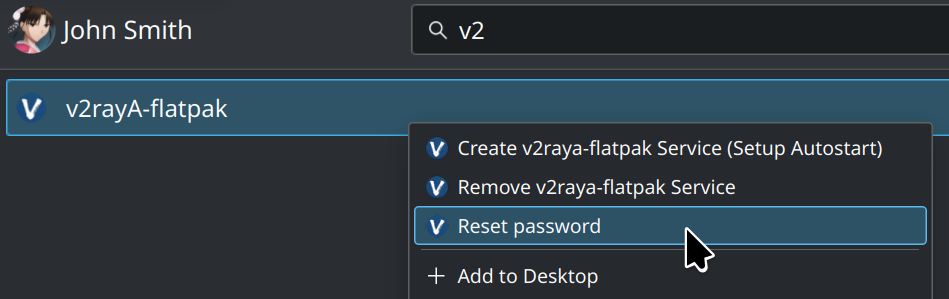

⚠️新版 flatpak 即使以 root 身份启动应用，在沙箱内也无法执行特权命令，所以本项目已经没有意义了，不会再更新了（2024-05-25）
# v2raya-flatpak
[](https://github.com/glaumar/v2raya-flatpak/actions/workflows/Flatter.yml)

v2rayA flatpak 格式安装包(非官方)，可下载到 SteamDeck 安装使用。

# 在 SteamDeck 上的使用方法
**所有操作均需要切换到桌面模式**

## 确保你知道自己的密码
如果你没设置过自己的密码，打开终端执行 `passwd` 设置密码。

## 安装
### 添加仓库
```shell
flatpak remote-add --if-not-exists v2raya-flatpak https://glaumar.github.io/v2raya-flatpak/index.flatpakrepo
```
### 安装
```shell
flatpak install -y io.github.glaumar.v2raya_flatpak
```
### 更新
```shell
flatpak update -y io.github.glaumar.v2raya_flatpak
```
或者也可以在应用商店（Discover）中更新

## 手动启动
SteamDeck 每次开机后切换到桌面模式，点击应用图标启动（需要root权限）。程序会在后台运行，启动完成或多次启动，会自动打开浏览器并访问 [localhost:2017](http://localhost:2017)。

## 设置/移除开机自启和重置密码
在启动器里，右键点击应用图标，选择对应功能选项即可（需要root权限）



**注意：如果你设置了开机自启，在卸载 v2raya-flatpak 前最好执行一次移除操作**

# 为什么不上传到 Flathub ？

1. 非v2rayA官方项目，不保证持续更新；
2. flatpak 设计上不适合打包系统后台服务，打包成 flatpak 格式只是为了方便 SteamDeck 使用。

---

